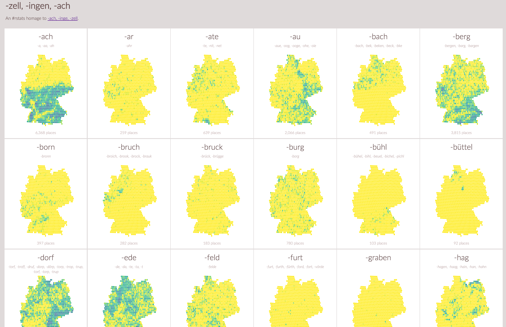

---
output:
  html_document:
    keep_md: true
  md_document:
    variant: markdown_github
---

<!-- README.md is generated from README.Rmd. Please edit that file -->

```{r, echo = FALSE}
knitr::opts_chunk$set(
  collapse = TRUE,
  comment = "#>",
  fig.path = "README-"
)
```

[](https://zenodo.org/badge/latestdoi/5630/hrbrmstr/zellingenach)

<h1>-zell, -ingen, -ach</h1>

An #rstats homage to [-ach, -inge, -zell](http://truth-and-beauty.net/experiments/ach-ingen-zell/).

Please see the [blog post](https://wp.me/p23idr-ZX) for more information. 

If you prefer a single- `source`-able version, see [this gist](https://gist.github.com/hrbrmstr/f3d2568ad0f27b2384d3).

For the impatient, you can just do:

    devtools::install_github("hrbrmstr/zellingenach")
    display_maps()

to see [the full visualization](http://rud.is/zellingenach.html):



### Code of Conduct

Please note that this project is released with a [Contributor Code of Conduct](CONDUCT.md). 
By participating in this project you agree to abide by its terms.
